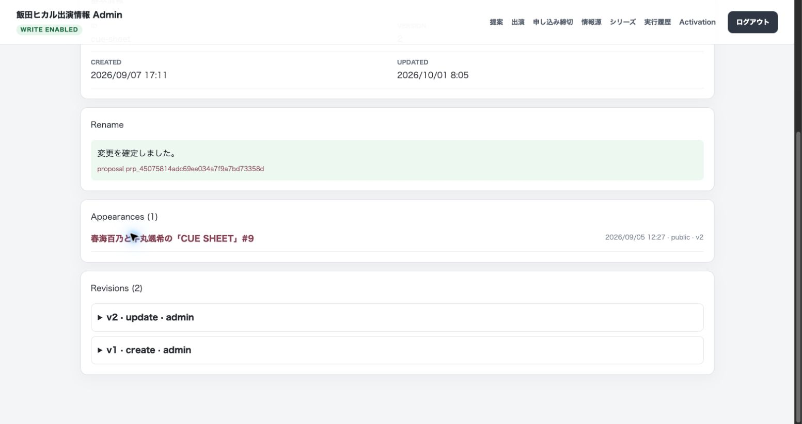

# 公開DB共有キャッシュの本番反映（2026-10-01）

## 反映範囲

公開ドメインは https://iida-hikaru-info.vercel.app 。既存VercelプロジェクトのProductionに、公開取得結果だけの `use cache: remote` を導入した。DBスキーマ変更・巡回基盤変更は行っていない。

- `bf3dedf`: ゲスト更新の日時精度修正に復旧記録と回帰テストを追加する。
- `9876a3d`: 公開DB取得結果を共有キャッシュし確定更新後に安全に失効する。
- ゲスト日時精度の修正本体は作業開始時の既存HEAD `f4a5178` に含まれており、変更を保持した。
- 上記を既存 `origin/main` へ通常push。秘密情報・`.env.local`・操作JSON・一時ログはcommitしていない。

Production限定で `PUBLIC_DB_CACHE_ENABLED=1`、本番DBと一致する `PUBLIC_CACHE_DB_SCOPE`、専用失効secret、固定HTTPS失効URLを設定した。既存Adminの設定は変更していない。専用secretの値は記録しない。

本ホストのGit管理外 `.env.local` にも失効URL・scope・secretを設定し、既存CLIが確定後に通知できる状態にした。ローカル読み取りキャッシュは有効化していない。別ホスト・別実行環境の巡回には同じ通知設定が別途必要。

## デプロイ

| 段階 | Deployment | 結果 |
| --- | --- | --- |
| 作業前Production | `dpl_HbaKbH4Vz19Hi8XvHHM9JDUTpMwk` | 退避先として確認 |
| OFF（Git連携） | `dpl_4J1K6qgVVKdqi7hqzQuATmYGwXpd` | 公開ドメインで回帰確認 |
| OFF（CLI候補） | `dpl_7FZ5bSxY7dcWW11iLMLLakFcWfYy` | READY、本番へ昇格せず |
| ON | `dpl_CGgd7NP88L81fmH3RjFSQiUgTiBV` | READY後に本番ドメインへ昇格・実測 |
| Preview | `dpl_HvNKstvdTACCFjEGpwFLciGay9oz` | 非キャッシュと失効拒否を確認 |

アプリコードは上記2commitの同一内容。デプロイ候補には `.env.local` や操作JSONをアップロードしていない。ProductionのFunctions配置は `iad1`。以下はこのProductionで観測した結果であり、全リージョン間の伝播を証明するものではない。記録の追加pushによるGit自動デプロイは同じアプリ実装・ON設定を引き継ぐ。

## 公開表示とDB取得

OFFで `/`・`/news`・`/deadlines`・`/?view=upcoming` がすべて200。ブラウザでもカレンダー・予定／履歴・新着・締切・フィルターの表示を確認した。シリーズ選択の先頭は学園アイドルマスター→ヒカROOM→軌跡を維持。ONでもエラーはなく、公開ページのブラウザconsole errorは0件。

ON直後に5回のHTTPリクエストを順次実行した。

| 順序 | パス | 公開取得の生成ログ |
| --- | --- | --- |
| 1 | `/` | 1回（出演170・締切7） |
| 2 | `/news` | なし |
| 3 | `/deadlines` | なし |
| 4 | `/news` | なし |
| 5 | `/?view=upcoming` | なし |

公開取得関数の1回は6 SELECT。生成ログ1回とソースの固定クエリ数から、この観測窓は6 SELECT相当。非キャッシュで同じ5回を読む想定30 SELECTと比べ、24 SELECT（80%）の削減となる。**DB全体で80%削減したという実測ではない**。本番DBに `pg_stat_statements` はなく、統計拡張の追加・統計resetは行っていない。

本番Neonを使ったCLI直接読み取りは2回とも実際に6 SELECT（合計12）、同じデータを返した。Production/ONフラグを与えても原取得関数はキャッシュされない。計数用の一時ハーネスはNeonへのHTTP SELECTだけを数え、未使用Adminルーティング依存を隔離した。DB取得・projection処理は実コードを使用した。

ONの各レスポンスの `now` は `07:47:06`、`07:47:07`、`07:47:08` などリクエストごとに進んだ（JST）。ページ内容・予定／履歴・締切状態の判定時刻は共有キャッシュへ入っていない。既存の実Nextテストでも、時計90秒前進による予定→履歴への移動を追加SELECTなしで検証済み。

## 確定後失効と通知失敗

CLI経路は、既存approvedのシリーズ操作を正規化inputのSHA-256と元idempotency keyが完全一致する場合に限って再実行した。DB上のstatus/hashも再照合し、新規変更へ進まないことを確認した。

- `approved` / `replayed: true` / `publicCacheInvalidation.status: invalidated`。
- 認証付きPOSTは200。その後の公開アクセスで生成ログが1回増え、後続ページで共有された。
- 前後で出演、シリーズ、情報元リンク、proposal、revision、締切等の9テーブルの全行fingerprintが一致。データ更新や監査履歴追加はなかった。
- 通知secretだけを子プロセス内で意図的に不正にした再実行では401・`failed`。DBはapprovedを保持し、同じ9テーブルは不変。実際の環境設定・secretは変更していない。
- 認証欠落401、scope不一致400、1025byte入力413も確認。これらはタグ失効やDBアクセスを実行しない。

TTLは `stale:30 / revalidate:600 / expire:900` 秒。温まったキャッシュに対する通知失敗後、実時間で再取得を観測した。

- 07:51:15 JSTに生成。通知認証失敗後の07:54台の取得でも再生成なし。
- 08:01:26から4回取得すると、08:01:27に生成1回（約612秒経過）、後続で共有。4レスポンスとも200。
- 最初のログ取得では生成ログがまだ反映されておらず、後続の取得で同じrequest時刻のログを確認した。ログ遅延をTTL未動作と扱わない。
- これは600秒の再検証・通知失敗時の再取得を確認したもの。900秒の強制expireを独立に実測したものではない。

## AdminとPreview

本番のAdminログインは200・`private, no-store`。未認証のAdmin本体・出演・締切は307でログインへ誘導しno-storeを維持。ユーザーがChromeでログイン後、提案一覧・シリーズ管理・同値更新Previewが正常に表示された。

Preview環境の公開3ページは200、公開キャッシュ生成ログは0件。これは非キャッシュ取得への迂回を示し、DB SELECTが0件という意味ではない。PreviewのAdmin入口は既存設定どおり404/no-store、失効POSTは503/no-store。Productionのタグを失効させていない。

Adminの同値更新Previewは200で、公開キャッシュ生成回数に変化はなかった。既存Admin画面には過去の確定キーを再送するUIがないため、ユーザーの明示了承を受け、「CUE SHEET → CUE SHEET」の同値更新1件を確定した。

- 08:05:03 JSTのServer Actionは200。画面に「変更を確定しました。」、version 2・revision 2を表示。ブラウザconsole errorは0件。
- TTL再生成から約4分後でも、確定後の次回公開アクセス（08:05:24 `/news`）に生成ログが1回増えた。続く `/`・`/deadlines` の生成は0回。Adminの `updateTag()` による即時失効を確認した。
- 11テーブルの全行fingerprintを前後比較。変更は `appearance_series`（既存1件のversion 1→2・updated_at）、`appearance_series_proposals`（1件追加）、`appearance_series_revisions`（1件追加）だけ。表示名は同じ。出演・ゲスト・マイクロ秒を含む日時・情報元・締切・それらのproposal/revisionはすべて不変。
- 確定proposalは `prp_45075814adc69ee034a7f9a7bd73358d`。この了承済み同値更新の監査記録は保持し、削除や巻き戻しはしていない。

## チェックと運用

本番反映前の188件の検証に加え、このターンでキャッシュテスト6件、ゲスト・日時精度・Admin関連テスト38件、実Next runtimeテスト4件を再実行し通過。lint、TypeScript型チェック、Next.js 16.3.4 production build、フィルター検証も通過した。

問題時はProductionの `PUBLIC_DB_CACHE_ENABLED=0` に更新して再デプロイする。環境変数変更だけでは現在のFunctionsへ反映されない。OFF版で公開3ページとAdminの回帰確認を済ませており、非キャッシュ取得へ戻せる。必要なら上記OFF版を昇格する。DBの復元・スキーマ変更は不要。失効失敗後は同じ確定キーでの冪等再試行と短いTTLを使う。

残る運用確認は、他ホストのAntigravity/CLI通知設定、複数リージョン間の失効伝播、900秒expire単独の実測、実アクセス下での総Neon負荷とRuntime Cache使用量・費用。開いたブラウザへ自動更新を配信する設計ではなく、Nextのクライアント再利用は最低30秒。本番データを別タイトルへ変更して戻す検証は行わず、更新内容反映は隔離DB実Nextテスト、Productionでは同値更新後の再取得ログで確認する。

Runtime CacheはHobbyを含む全プランで利用でき、リージョンごとのキャッシュとなる。料金と利用量は[公式Runtime Cache説明](https://vercel.com/docs/caching/runtime-cache)・[地域別料金](https://vercel.com/docs/pricing/regional-pricing)とVercel Usageを継続確認する。
